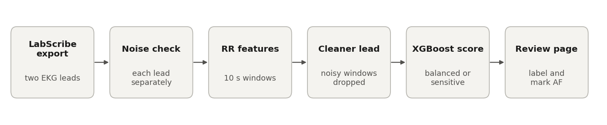

# AF-EKG

AF-EKG is a Python tool for finding atrial fibrillation (AF) in mouse EKG recordings. It reads two-lead recordings exported from LabScribe (iWorx), removes the noise bursts these systems often pick up, scores each recording for AF and produces a review page where an investigator checks the flagged recordings, marks the AF sections and exports a final label.

## Citation

A paper describing the method is in preparation. Until then, please cite the dataset the model was built on:

Sharma K, Wang X, Li J, Sweat M, Buzon S, De Felice A, Pu WT. *Atrial Fibrillation (AFib) Dataset.* Zenodo (2026). https://doi.org/10.5281/zenodo.23019834

## Overview



Each recording is cut into 30 s blocks, starting at 10 s, and each block into eleven 10 s windows. For every window the tool finds the heartbeats, measures how irregular the beat-to-beat (RR) intervals are, and an XGBoost classifier scores how AF-like the window is. A recording's score is its highest window score.

**Noise.** iWorx recordings often contain noise bursts of a few seconds that affect one lead at a time. Noise creates false beats, which look like an irregular rhythm. The tool checks each lead separately, using only beat shape and amplitude, never rhythm. It then reads every window from the cleaner lead and leaves out windows that are noisy in both.

**Two modes.**

| Mode | Reads | Threshold | Use it to |
|---|---|---|---|
| `balanced` | seconds 10 to 40 | 0.961 | get the most accurate call per recording |
| `sensitive` | every 30 s block | 0.865 | screen many recordings and pass every possible AF to a reviewer |

The sensitive mode scans the whole recording. This is what catches paroxysmal AF that starts after the first 40 s.

**Performance.** Measured on the published dataset with cross-validation split by animal (245 recordings from 127 mice in three labs):
- **Balanced mode:** recall 0.84 and specificity 0.95 (AUC 0.959).
- **Sensitive mode:** recall 0.98 and specificity 0.72.

## Installation

Clone the repository and install the requirements into Python 3.10 or later:

```bash
git clone https://github.com/Kushaan-SSSK/AF-Analysis.git
cd AF-Analysis
pip install -r requirements.txt
```

## Basic requirements

```
python>=3.10
numpy==2.2.6
pandas==2.3.3
scipy==1.15.3
scikit-learn==1.7.2
xgboost==3.2.0
neurokit2==0.2.13
joblib==1.6.0
pytest               # only for the tests
```

## Usage

**Score recordings and review them.** Pass LabScribe text exports (`.txt` or `.xls`):

```bash
python predict.py path/to/exports/*.txt --mode sensitive --csv review_list.csv --report review.html
```

`review_list.csv` lists every recording with both modes' scores and calls, the AF-like blocks, and a `flagged` column for the chosen mode. Open `review.html` in any browser.

**Prepare your own recordings.** [docs/data_preparation.md](docs/data_preparation.md) walks through exporting from LabScribe, filling in the metadata sheet and running:

```bash
python prepare_dataset.py --exports path/to/exports --metadata metadata.csv --lab XX --out path/to/dataset
```

**Review a whole dataset.**

```bash
python databank_report.py --databank path/to/dataset --out databank_report.html
```

**Retrain.**

```bash
python train.py --databank path/to/dataset
```

This writes `models/af_model.joblib`, `cv_metrics.csv` and `cv_predictions.csv`. Retraining on the published dataset reproduces the model in `models/` exactly. `--no-noise-step` trains without the denoising step, and `--row-order-seed N` shuffles the training rows to check how much results depend on row order.

## Repository contents

| File | Description |
|---|---|
| `af_ekg/features.py` | Reading exports, filtering, R-peak detection, RR features per window and block |
| `af_ekg/noise.py` | Per-lead noise detection |
| `af_ekg/denoise.py` | Choosing the cleaner lead per window, dropping noisy windows |
| `af_ekg/model.py` | Classifier, the two modes, animal-grouped cross-validation, thresholds |
| `af_ekg/pipeline.py` | Full analysis of one recording |
| `af_ekg/report.py` | HTML review page |
| `predict.py` | Scoring and review list |
| `prepare_dataset.py` | Converts LabScribe exports and metadata into the dataset format |
| `databank_report.py` | Review page for a whole dataset |
| `train.py` | Cross-validation and training |
| `models/` | Trained model and cross-validated predictions for both modes |
| `docs/` | Data preparation guide, metadata template, README figure |
| `tests/` | Tests |

## Acknowledgements

The recordings were collected by Jiajin Li, Sofia Buzon and Mason Sweat. Alessandro De Felice helped annotate the rhythms using his clinical training. Xuezhu Wang and William T. Pu supervised the project.

## Support

Questions, suggestions and bug reports are welcome in the [issue tracker](https://github.com/Kushaan-SSSK/AF-Analysis/issues).

Scores are for research use and are not a clinical diagnosis.
