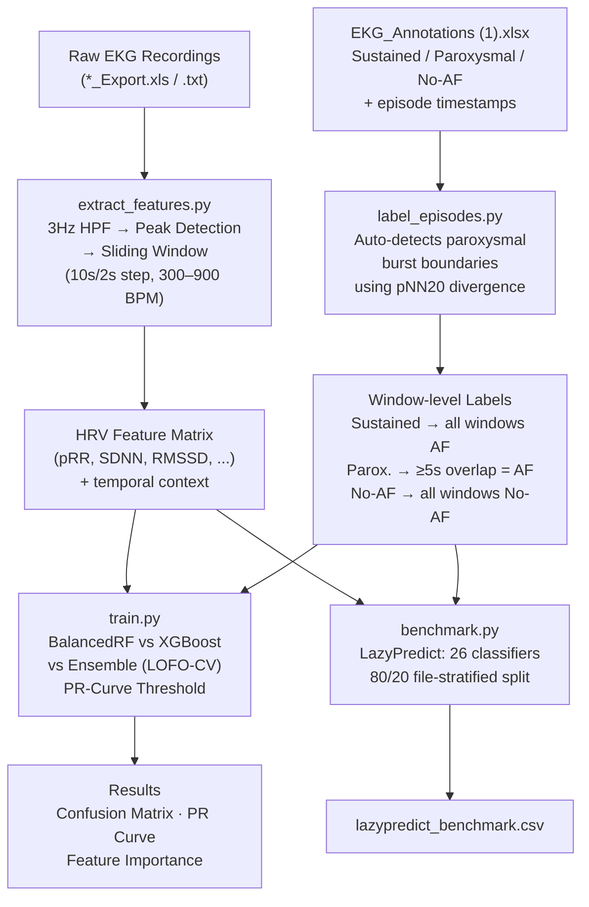

# Pipeline Flowchart

End-to-end overview of the AF detection framework.

```mermaid
flowchart TD
    A["Raw EKG Recordings<br>(*_Export.xls / .txt)"]
    B["extract_features.py<br>3Hz HPF → Peak Detection<br>→ Sliding Window<br>(10s/2s step, 300–900 BPM)"]
    C["HRV Feature Matrix<br>(pRR, SDNN, RMSSD, ...)<br>+ temporal context"]
    D["EKG_Annotations (1).xlsx<br>Sustained / Paroxysmal / No-AF<br>+ episode timestamps"]
    E["label_episodes.py<br>Auto-detects paroxysmal<br>burst boundaries<br>using pNN20 divergence"]
    F["Window-level Labels<br>Sustained → all windows AF<br>Parox. → ≥5s overlap = AF<br>No-AF → all windows No-AF"]
    G["train.py<br>BalancedRF vs XGBoost<br>vs Ensemble (LOFO-CV)<br>PR-Curve Threshold"]
    H["Results<br>Confusion Matrix · PR Curve<br>Feature Importance"]
    I["benchmark.py<br>LazyPredict: 26 classifiers<br>80/20 file-stratified split"]
    J["lazypredict_benchmark.csv"]

    A --> B --> C
    D --> E --> F
    C --> G
    F --> G
    G --> H
    C --> I
    F --> I
    I --> J
```
